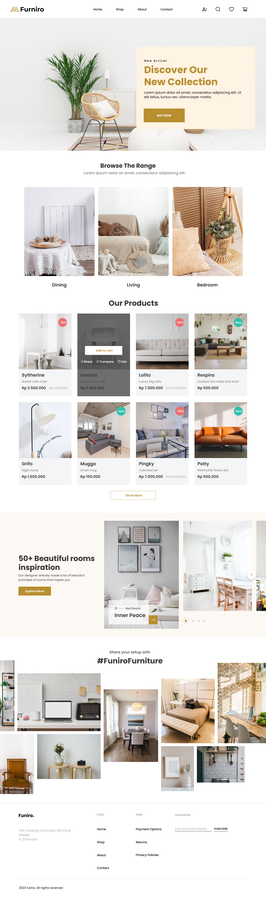

# My React Project

Welcome to my React project! This application is built using React and Vite.js for a fast and efficient development experience. It leverages Tailwind CSS for styling, with Swiper integrated for smooth and responsive sliders.

---

## Project Structure

Here's an overview of the project's folder structure:

- **components/**

  - `Footer` - The footer section of the site.
  - `HashtagSection` - A section displaying popular hashtags.
  - `Header` - The header section containing navigation.
  - `HeroSection` - The hero section with introductory content.
  - `InspirationSection` - Displays inspiration or motivational content.
  - `Products` - Lists available products.
  - `Slider` - A Swiper-based slider for showcasing items.
  - `ThemeSelector` - A theme selector utilizing UI, appearing as a dropdown menu in the footer.

- **fonts/**

  - Contains custom font files used throughout the project.

- **public/**
  - Stores static images and other public assets.

---

## Technologies Used

- **React** - For building UI components and managing state.
- **Vite** - A fast build tool and development environment for modern web projects.
- **Tailwind CSS** - For utility-first, responsive styling.
- **Swiper** - Used to create smooth and responsive sliders.

---

## Getting Started

To set up and run this project locally:

1. Clone the repository:

   ```bash
   git clone https://github.com/seyedahmaddv/furniro-react-app.git
   ```

2. Navigate to the project directory:

   ```bash
   cd your-repo-name
   ```

3. Install dependencies:

   ```bash
   npm install
   ```

4. Start the development server:
   ```bash
   npm run dev
   ```

Your application should now be running at `http://localhost:5173`.

---



---

## About the Developer

This project was created by **Aashish Kushwaha**. I am passionate about web development, especially using tools like React.js and Node.js to create responsive and modern web applications.

**LinkedIn**: [Seyed Ahmad Gholami](https://www.linkedin.com/in/seyedahmaddv/)

---

## Contributing

Contributions, issues, and feature requests are welcome! Feel free to check the [issues page](https://github.com/seyedahmaddv/furniro-react-app/issues) to see open issues or submit your ideas.

---

Thank you for visiting! Hope you enjoy exploring the project.
